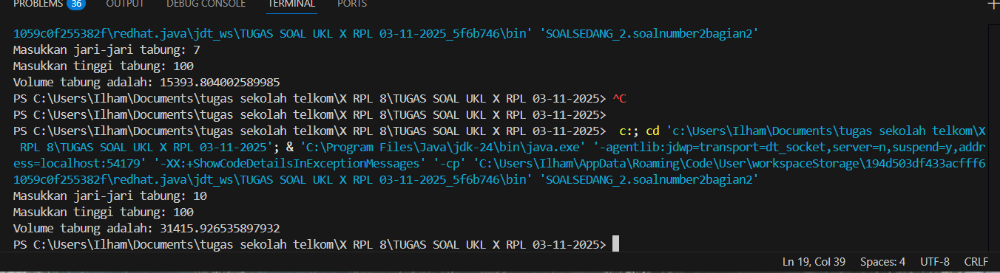

💧 Program Menghitung Volume Tabung
📘 Deskripsi

Program ini digunakan untuk menghitung volume tabung berdasarkan jari-jari dan tinggi yang dimasukkan oleh pengguna.
Perhitungan dilakukan menggunakan fungsi dengan parameter, yaitu method hitungVolume(double jariJari, double tinggi).

⚙️ Cara Kerja Program

Pengguna diminta untuk memasukkan jari-jari tabung dan tinggi tabung.

Program akan memanggil fungsi hitungVolume() dengan dua parameter tersebut.

Fungsi menghitung volume menggunakan rumus:

Volume
=
𝜋
×
𝑟
2
×
𝑡
Volume=π×r
2
×t

Hasil perhitungan ditampilkan ke layar.

🧩 Kode Program
package SOALSEDANG_2;
import java.util.Scanner;

public class soalnumber2bagian2 {

    static double hitungVolume(double jariJari, double tinggi) {
        double volume = Math.PI * jariJari * jariJari * tinggi;
        return volume;
    }

    public static void main(String[] args) {
        Scanner input = new Scanner(System.in);

        System.out.print("Masukkan jari-jari tabung: ");
        double r = input.nextDouble();

        System.out.print("Masukkan tinggi tabung: ");
        double t = input.nextDouble();

        double volume = hitungVolume(r, t);

        System.out.println("Volume tabung adalah: " + volume);

        input.close();
    }
}

🧮 Contoh Hasil Program

Contoh Input & Output:

Masukkan jari-jari tabung: 7
Masukkan tinggi tabung: 10
Volume tabung adalah: 1539.3804002589986

🖼️ Screenshot Hasil Program
